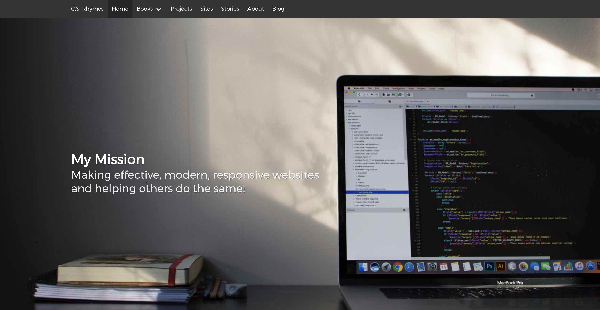

### Design&Development

복잡하고 비효율적인 기획,디자인,개발 과정을 더 쉽고 효율적으로 디자인을 컴포넌트화 하여 유지보수와 최적화 하는것을 지향합니다.

### UI Development & Markup
프로젝트에 사용되는 코드를 아래와 같이 정리했습니다.

* [Sidebar](/)
* Menubar
* Tabs
* Footer
* Hero
* Contents
* Landing Page With Callouts
* Sponsors Page
* Image Gallery
* Recipe Page
* Blog
* Post
